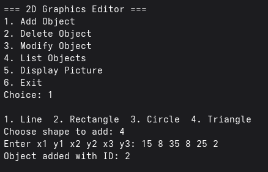
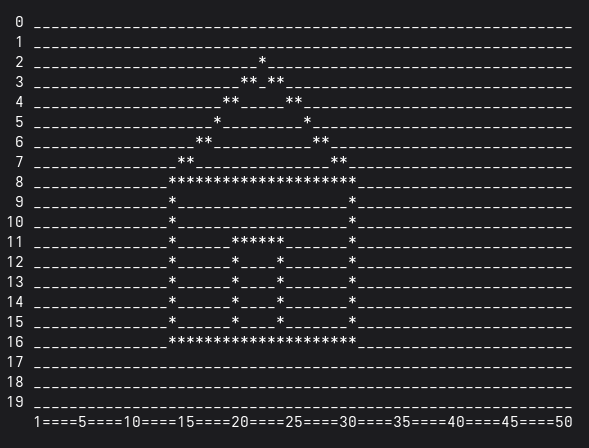

# 2D Graphics Editor

## Exmaple
```bash
 0 ____________________*******_________________________________
 1 __________________***_____***______*________________________
 2 _________________*___________*______*_______________________
 3 ________________*_____________*_____*_______________________
 4 _______________*_______________*_____*______________________
 5 ______________*_________________*____*______________________
 6 ______________*_________________*_____*_____________________
 7 _____________**_________________**_____*____________________
 8 _____________*___________________*_____*____________________
 9 _____________*___________________*______*___________________
10 _____________*___________***********____*___________________
11 _____________*___________*_______*_*_____*__________________
12 _____________*___________*_______*_*_____*__________________
13 _____________**__________*______**_*______*_________________
14 ______________*__________*______*__*_______*________________
15 ______________*__________*______*__*_______*________________
16 _______________*_________*_____*___*________*_______________
17 ________________*________*____*____*________*_______________
18 _________________*_______*___*_____*_________*______________
19 __________________***____****______*________________________
   1====5====10====15====20====25====30====35====40====45====50

```


## Screenshots

### Main Menu



### Sample Drawing (House)



## Description

A menu-driven 2D Graphics Editor in C using a 2D character array as the drawing canvas.

## Features

* Add Line
'''text
x1 y1 x2 y2
'''
* Add Rectangle
'''text
x y width height
'''
* Add Circle
'''text
center_x center_y radius
'''
* Add Triangle
'''text
x1 y1 x2 y2 x3 y3
'''
* Modify Existing Objects
* Delete Objects
* List Objects
* Display Canvas

## Canvas Specifications

* Width: 60
* Height: 20
* Maximum Objects: 50


## Menu

```text
1. Add Object
2. Delete Object
3. Modify Object
4. List Objects
5. Display Picture
6. Exit
```

## Author

**Anish Kumar Sah**
*R25EH017